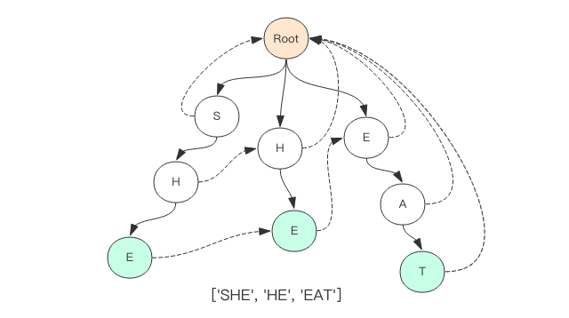

## FastScan
苦于没有找到一个比较合适的敏感词过滤库，所以我自己花了点时间撸了一个。
它基于广为人知的 ahocorasick 字符串匹配算法，使用原生的 js 实现，浏览器和服务端都可以使用。


## 演示地址
[FastScan PlayGround](https://pyloque.github.io/fastscan/)

## 安装方法
```
# 安装到当前项目
npm install --save fastscan
```

## 使用方法
```
import FastScanner from fastscan

var words = ["今日头条"，"微信", "支付宝"]
var scanner = new FastScanner(words)
var content = "今日头条小程序终于来了，这是继微信、支付宝、百度后，第四个推出小程序功能的App。猫眼电影率先试水，出现在今日头条。"
var offWords = scanner.search(content)
console.log(offWords)
var hits = scanner.hits(content)
console.log(hits)

-------------
[ [ 0, '今日头条' ], [ 15, '微信' ], [ 18, '支付宝' ], [ 53, '今日头条' ] ]
{ '今日头条': 2, '微信': 1, '支付宝': 1 }
```

## API

1. 查询匹配的词汇以及所在字符串的位置 search(content, option={})
2. 查询匹配词汇的命中数量 hits(content, options={})
3. 临时动态增加词汇，不修正其它词汇的回溯指针 add(word)

```
options = {quick: false, longest: false}
```
1. quick 选项表示快速模式，匹配到一个就立即返回
2. longest 表示最长模式，同一个位置出现多个词汇(中国、中国人)，选择最长的一个(中国人)
3. 默认匹配出所有的词汇，同一个位置可能会出现多个词汇

## 性能
项目代码使用原生的 js 实现，我开始非常担心词汇树的构建速度会不会太慢。经测试后发现虽然性能不算太快，不过也不是太差，对于绝大多数项目来说已经绰绰有余了。我分别测试了构造 20000～100000 个词汇的树结构，每个词汇随机在 10～20之间，耗时情况如下

单词数|耗时
-------|--------
 20000 words   | 385ms   
 40000 words   | 654ms   
 60000 words   | 1108ms   
 80000 words   | 1273ms   
 100000 words   | 1659ms   

如果你的词汇比较短小，构建树的速度还会更快。

查询性能我并不担心，因为 ahocorasick 算法在词汇长度较短的情况下复杂度是 O(n)，性能和被过滤内容的长度呈线性变化。下面我使用 100000 词汇量构建的树分别对 20000 ～ 100000字的内容进行了过滤，耗时情况如下

字数|耗时
---|----
| 20000 words   | 14ms   | 
| 40000 words   | 32ms   | 
| 60000 words   | 67ms   | 
| 80000 words   | 71ms   | 
| 100000 words   | 84ms   | 

fastscan 可以做到以迅雷不及掩耳的速度扫遍一幅 10w 字的长文，10w 大概就是一部中篇小说的长度了。如果你要扫百万字的长篇小说，那还是建议你分章分节来扫吧。

内存占用也是需要考虑的点，内存对于 Node 程序来说本来就非常有限，如果因为敏感词树占据了太大的内存那是非常要不得的大问题。所以我也对内存占用进行了测试，下面是测试的结果

词汇数|内存占用
-----|-------
| 0 words   | 14M   | 
| 20000 words   | 81M   | 
| 40000 words   | 135M   | 
| 60000 words   | 184M   | 
| 80000 words   | 234M   | 
| 100000 words   | 277M   | 

词汇量不是太大的话，这样的内存占用还是可以接受的。如果你对内存占用不满意，那就只能使用 Node 的 C 语言扩展来打造更高性能的库了，考虑到成本问题，恕我目前无能为力。


如果读者比较关心算法的原理和细节，扫一扫上面的二维码关注我的公众号「码洞」，后续我会编写相关文章来仔细讲解算法的原理，以及对 fastscan 项目代码的剖析。
